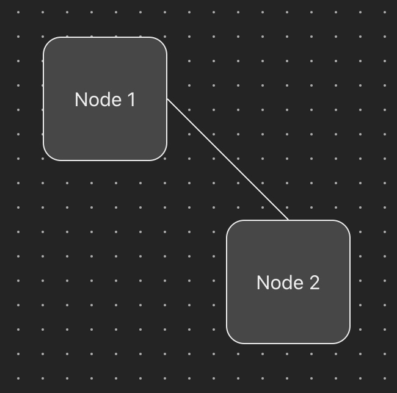
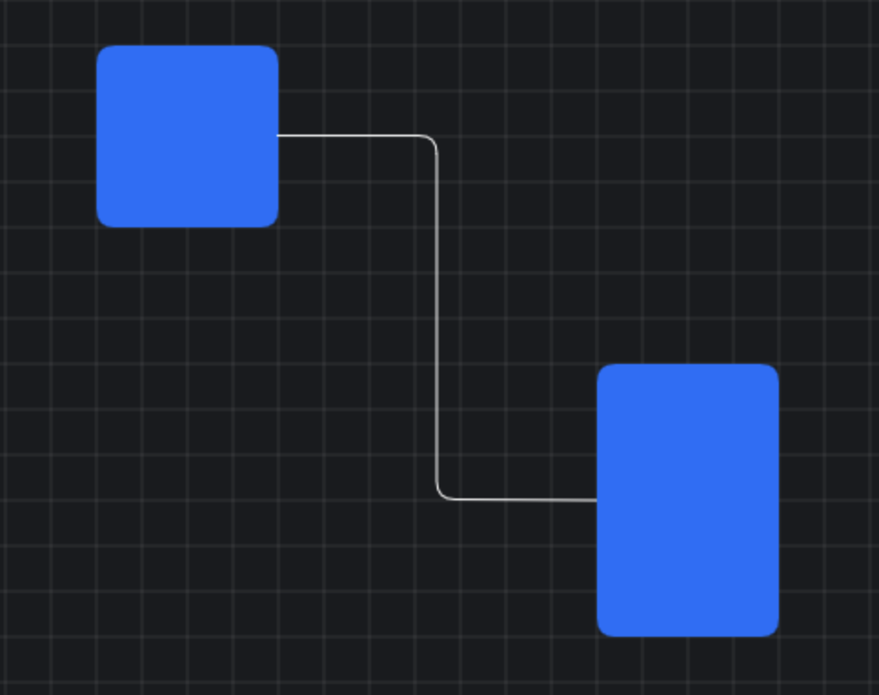
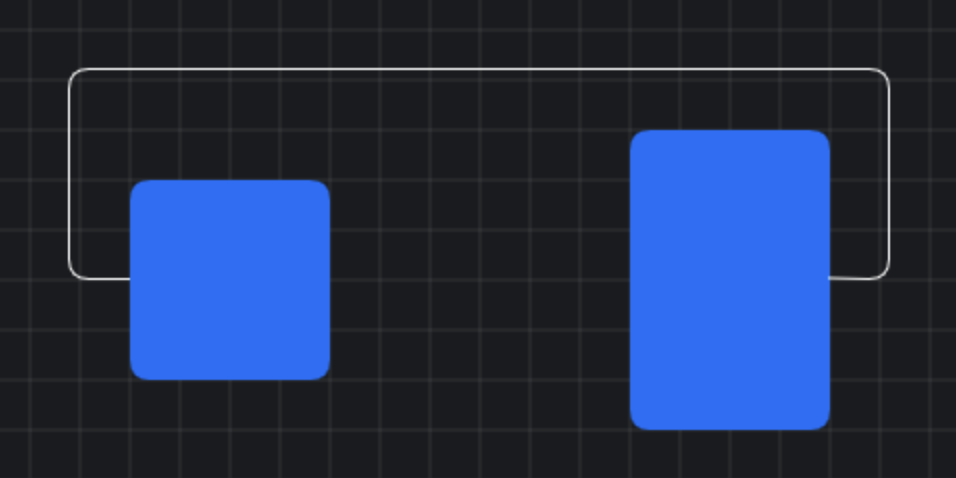

This is a very simple react application that draws SVG lines between HTML nodes.

Currently it can draw simple straight lines like this

We are trying to solve a problem where we need to reliably draw an orthogonal connection line between two html elements (we will call them nodes). The proposed solution is to create a SVG element and place it behind the DOM elements, then calculate mid points of the two nodes and draw an SVG path. Problem arises when we want to move away from straight lines and want to draw orthogonal lines. Here we must apply some well known algorithm to efficiently draw the connection lines.

Depending on the nodes position connection lines may take various shapes, for example the following two diagrams show how the connection lines can be drawn based on where on DOM the elements are located.

# Quick start

- Install dependencies: `yarn`
- Run tests: `yarn test`
- Start the dev server: `yarn dev`